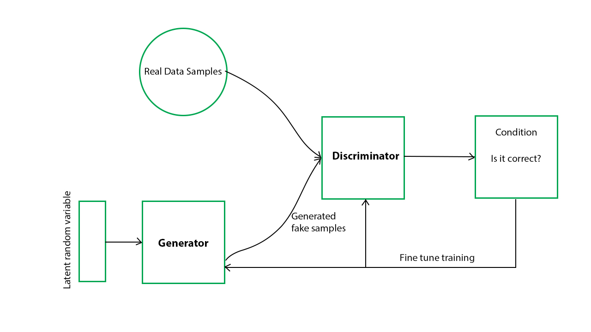

# GAN
GAN implementation on MNIST Dataset

Generative Adversarial Networks (GANs) can be broken down into three parts:

Generative: To learn a generative model, which describes how data is generated in terms of a probabilistic model.
Adversarial: The training of a model is done in an adversarial setting.
Networks: Use deep neural networks as the artificial intelligence (AI) algorithms for training purpose.
In GANs, there is a generator and a discriminator. The Generator generates fake samples of data(be it an image, audio, etc.) and tries to fool the Discriminator. The Discriminator, on the other hand, tries to distinguish between the real and fake samples. The Generator and the Discriminator are both Neural Networks and they both run in competition with each other in the training phase. The steps are repeated several times and in this, the Generator and Discriminator get better and better in their respective jobs after each repetition. The working can be visualized by the diagram given below:

Here, the generative model captures the distribution of data and is trained in such a manner that it tries to maximize the probability of the Discriminator in making a mistake. The Discriminator, on the other hand, is based on a model that estimates the probability that the sample that it got is received from the training data and not from the Generator.
The GANs are formulated as a minimax game, where the Discriminator is trying to minimize its reward V(D, G) and the Generator is trying to minimize the Discriminator’s reward or in other words, maximize its loss. 
